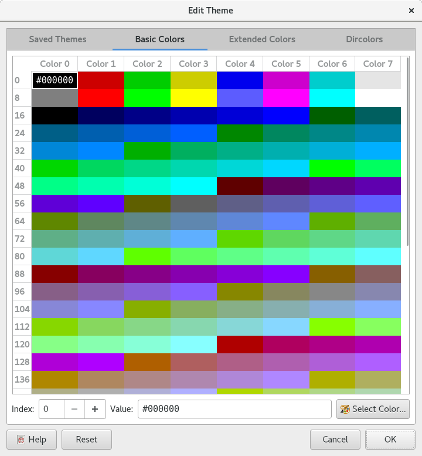

.. Copyright © 2018 TermySequence LLC
.. SPDX-License-Identifier: CC-BY-SA-4.0

.. post:: 12 Oct 2018
   :tags: article

All About Color Themes
======================

The 1.1.1 release of :program:`qtermy` includes 8 new color themes by graphic designer `Katharine Scott <https://kgrayscott.com/>`_. This makes it a good time to explain *everything you ever wanted to know* about how terminal colors are handled in TermySequence.

Palette
-------

First, the terminal palette itself. TermySequence specifies 300 individual colors:

  * 8 primary colors, used by SGR 30-37 and 40-47 (`bash demo <../_static/examples/sgr16color.bash>`_).
  * 8 bright colors, used by SGR 90-97 and 100-107 (`bash demo <../_static/examples/sgr16color.bash>`_).
  * 240 additional colors, used by SGR 38;5;16-255 and 48;5;16-255 (`bash demo 2 <../_static/examples/sgr240color.bash>`_).
  * 14 extended XTerm colors, of which only two (primary foreground and primary background) are used by TermySequence.
  * 30 extended TermySequence colors, used for interface elements such as the marks and minimap.

All 300 colors (minus the unsupported XTerm colors) can be individually customized using the :doc:`Theme Editor <td:dialogs/theme-editor>`. In practice, the 240 additional colors are usually left unchanged. Note that it's actually possible to bypass the palette and specify any true 24-bit color using SGR 38;2;R;G;B and 48;2;R;G;B (`bash demo 3 <../_static/examples/sgrtruecolor.bash>`_).

The 30 extended TermySequence colors have the ability to be *disabled*, which causes a default color or transparency to be used instead. On the wire and in configuration files, a disabled color is indicated by having its high bit set.

Some colors can be modified from within the terminal by using OSC escape sequences. Whether such modifications are honored by TermySequence is discussed in :ref:`remote-colors` below.

Dircolors
---------

TermySequence also supports dircolors which are used in the :doc:`Files tool <td:tools/files>`. They can be edited on the :doc:`Dircolors tab <td:dialogs/dircolors-editor>` of the Theme Editor.

The setting consists of a string in :manpage:`dircolors(1)` format, with two extensions:

  * A leading plus sign or a completely empty string causes inheritance from the application default dircolors.
  * Substitution variables can be defined and used to avoid repeating the same color specification for hundreds of individual file extensions.

Within the Files category of the :doc:`profile <td:settings/profile>` is a setting that causes the :envvar:`LS_COLORS` environment variable to be set appropriately when launching the terminal. This will cause the dircolors in the terminal to match the ones in the Files tool. However, it's important to note that subsequent changes to the terminal's theme will **not** be reflected in that environment variable.

Profile versus Theme
--------------------

Each profile stores its own independent palette and dircolors. Each individual terminal also has its own independent palette and dircolors, initially populated from the terminal's profile but capable of being adjusted directly.

Editing the palette directly is tedious, so TermySequence provides a number of predefined color themes consisting of a palette and dircolors. It's possible to create and share additional themes. Check out the builtin `Solarized <http://ethanschoonover.com/solarized>`_ light and dark themes with custom dircolors!

The profile settings and :ref:`Adjust Colors dialog <td:adjust-colors>` have dropdowns that allow a predefined theme to be selected. Selecting one will apply the theme's palette and dircolors to the profile or terminal. However it's important to note that because profiles and terminals have their own independent settings, changing a theme will *not* change any terminals or profiles. A profile or terminal whose settings do not match any predefined theme will be shown as having a "Custom Color Theme" in the dropdown.

.. _remote-colors:

Remote Colors
-------------

TermySequence is designed for collaboration, with multiple people connecting to the same server and working in the same terminals. It's possible to display the color themes that other users have assigned to their terminals. To make this work, :program:`qtermy` pushes color theme to the server using the :term:`attribute <td:attribute>` system.

Within the Collaboration category of the :doc:`profile <td:settings/profile>` is a setting to control the display of remote colors. The three options for the setting are as follows:

   Ignore remote settings
      No remote colors are displayed

   Show remote user settings
      Colors set by other users are displayed on the terminals that they own

   Show remote user and program settings
      Like the previous setting, but also honors palette changes made from within the terminal using OSC sequences.

Also relevant is the "Discard remote settings when taking terminal ownership" setting. If enabled, colors will be pushed to the server upon taking ownership of a terminal, allowing other users to see them. If disabled, colors will not be pushed and the terminal will retain its existing colors.

If another user has a color theme that you like, it's possible to save it as a local profile using the :doc:`Extract Profile <td:dialogs/extract-profile>` option in the Settings menu. This saves all of the remote user's profile settings, not just colors, so be sure to review the profile before using it.

Miscellaneous Remarks
---------------------

Some terminal emulators support displaying bold and italic text using colors instead. TermySequence does not support this option.

``xterm-256color`` is the appropriate value for the :envvar:`TERM` environment variable within TermySequence terminals. Any inconsistencies with XTerm which cause real applications to break should be reported as issues on `GitHub <https://github.com/TermySequence/termysequence/issues>`_.
