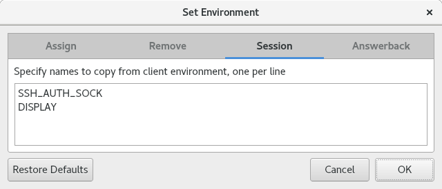
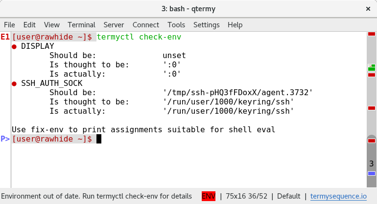

.. Copyright © 2018 TermySequence LLC
.. SPDX-License-Identifier: CC-BY-SA-4.0

.. post:: 10 Oct 2018
   :tags: article

Session Environment Variables
=============================

TermySequence is a terminal emulator multiplexer, designed to run as a daemon process or socket-activated :program:`systemd` user service. As such, :program:`termy-server` and its terminals tend to outlive user login sessions made via console login or :program:`ssh`.

Problem is, there exist various environment variables whose lifecycle is tied to a specific login session. The canonical examples are :envvar:`DISPLAY`, which points to the user's X server, and :envvar:`SSH_AUTH_SOCK`, which points to the user's SSH agent. If these variables are unset within a terminal, or worse, set to a stale value, then the functionality enabled by the variables will not work within the terminal. Setups exist for specific variables to make them work with multiplexers, such as `this one <https://gist.github.com/martijnvermaat/8070533>`_ for :envvar:`SSH_AUTH_SOCK`.

One way to guarantee terminals get the proper environment is to launch a separate, dedicated multiplexer within each login session. :program:`qtermy` does this by default, spawning a private :program:`termy-server` instance using the ``--standalone`` option. This is referred to in the documentation as the :term:`transient local server <td:transient local server>`. Because it is a child process of :program:`qtermy`, it inherits the correct environment from the desktop session. It's also possible to launch a standalone server on a remote system by using a :doc:`connection <td:settings/connection>` with ``--standalone`` added to the command. It will inherit the environment set up by :program:`sshd`.

While it inherits the correct environment, a standalone server has drawbacks:

  * It's not persistent. It and its terminals will exit immediately once the parent process exits.
  * It's private. It can only be accessed by the parent process because it does not listen on a socket for additional client connections.

Starting with version 1.1.0, TermySequence provides another way to deal with session environment variables. First, specify the variables that should be considered per-session. This is done in the :doc:`profile settings <td:settings/profile>`, with the aforementioned two variables being the default as shown:

:program:`termy-server` reads the environment of each client process that connects to it. New terminals created by a client inherit any session variables set in the client's environment. When a client takes ownership of an existing terminal, its environment is compared to the terminal's environment. If any session variables differ, :program:`qtermy` will display a warning in the status bar:

Within a terminal, :command:`termyctl check-env` prints the state of all session variables. :command:`termyctl fix-env` prints variable assignment statements suitable for shell evaluation.

With this new scheme, it's possible to keep session environment variables up to date in persistent multiplexers. However the scheme has its own drawbacks, which may be the subject of future work:

  * The server reads client environments from :file:`/proc` which is Linux-specific. This also reports only the initial environment, omitting any changes made by the process itself. Fixing this will require revising the :doc:`TermySequence protocol <td:protocol>` to allow the client to explicitly report its environment.
  * The server's idea of a terminal's environment might differ from the terminal's actual environment. This is reflected in the "is thought to be" and "is actually" fields of the ``check-env`` output. This is generally not a problem in practice since session variables tend to be inherited. It could be mediated by automatically running ``fix-env`` before each shell prompt, but:
  * The ``check-env`` and ``fix-env`` commands work by reading information through the terminal using escape sequences. Doing this requires placing the terminal into raw mode which appears to break bash when run from :envvar:`PROMPT_COMMAND`. Because of this, ``fix-env`` can't be run automatically and must be run manually in each terminal. Fixing this will require :program:`termyctl` to read the information some other way, either via a socket or something more exotic like a FUSE filesystem.
